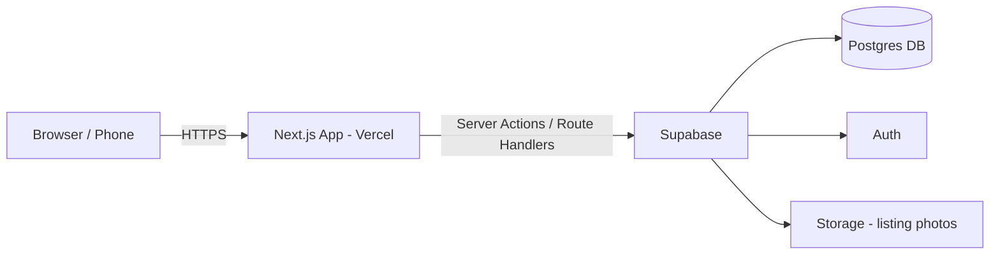
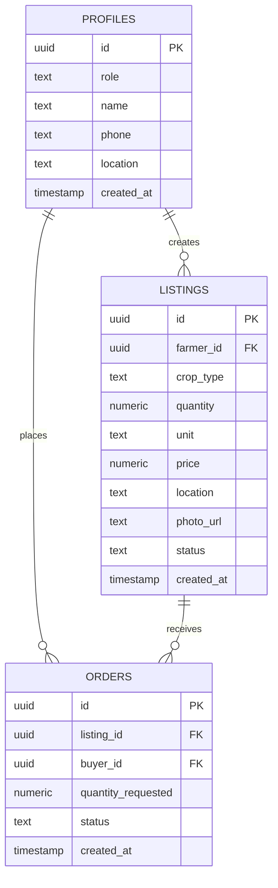

# System Design Document

## 1. Architecture Overview

Single Next.js application handles both UI and API logic (via Route Handlers / Server Actions), deployed on Vercel. Supabase provides the database, authentication and file storage — no separate backend service to build, deploy or coordinate during the hackathon.

## 2. Tech Stack

| Layer | Choice |
|---|---|
| Frontend + API | Next.js 14 (App Router), TypeScript |
| Database | Supabase Postgres |
| Auth | Supabase Auth |
| File storage | Supabase Storage (produce photos) |
| Styling / UI | Tailwind CSS + shadcn/ui |
| Hosting | Vercel (app), Supabase Cloud (DB/Auth/Storage) |

Full reasoning and trade-offs for each of these choices are in `REASONING_AND_TRADEOFFS.md`.

## 3. Database Schema (MVP)

Notes:
- `profiles` extends Supabase's built-in `auth.users` (one row per user, holding role + farmer/buyer-specific fields)
- `listings.status`: `active` / `closed`
- `orders.status`: `requested` / `confirmed` / `rejected` / `completed`

## 4. Key Workflows

**Listing creation**
1. Farmer submits the new-listing form (client component)
2. Server Action validates input and inserts into `listings`, tagging `farmer_id` from the authenticated session
3. Row Level Security policy ensures only that farmer can later edit/delete it

**Order request → confirmation**
1. Buyer submits an order request on a listing → row inserted into `orders` with status `requested`
2. Farmer's dashboard queries `orders` where `listing.farmer_id = current user`
3. Farmer confirms/rejects → Server Action updates `orders.status`
4. Buyer's dashboard reflects the new status on next load (polling is fine for MVP; Supabase Realtime is a stretch upgrade)

## 5. Deployment

- Repo hosted on GitHub, connected to Vercel for auto-deploy on push to `main`
- Vercel preview deployments on every pull request — useful for the team to review each other's work without merging first
- Supabase project shared with the team via project URL + anon/public key stored in `.env.local` (never committed — add `.env.local` to `.gitignore`)

## 6. Out of Scope for This Build

- Payment processing
- Transport/logistics coordination
- Automated supplier matching / farmer aggregation algorithm
- Ratings & reviews
- Admin verification workflow

These map directly to the "Stretch" list in `SRS.md` and the full problem statement's longer-term vision in `PROBLEM_STATEMENT.md`.